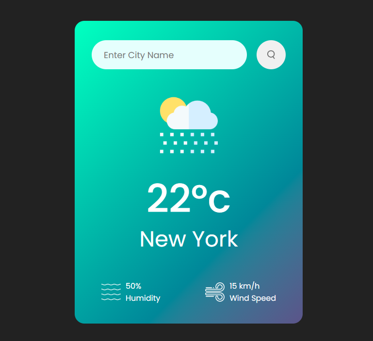

# weather-app
Weather application built with HTML, CSS, JavaScript, and Weather API integration.

A responsive weather application built using HTML, CSS, and JavaScript that fetches real-time weather data from a Weather API.

## Features

* Real-time weather information
* Search weather by city name
* Current temperature display
* Weather conditions (Cloudy, Sunny, Rainy, etc.)
* Humidity and wind speed information
* Responsive design for all devices
* API integration using JavaScript Fetch API

## Technologies Used

* HTML5
* CSS3
* JavaScript (ES6)
* Weather API
* Fetch API

## Project Structure

weather-app/
│
├── index.html
├── style.css
├── script.js
└── assets/

## Project Goal

This project was created while learning JavaScript and API integration. The main objective was to understand how to fetch and display real-time data from external APIs.

## Preview

Enter a city name to view current weather conditions, temperature, humidity, and other weather details.

## Author

Nadia

---

Built with using HTML, CSS, JavaScript, and Weather API.

